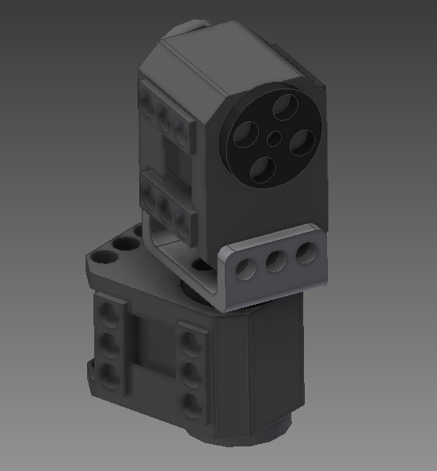
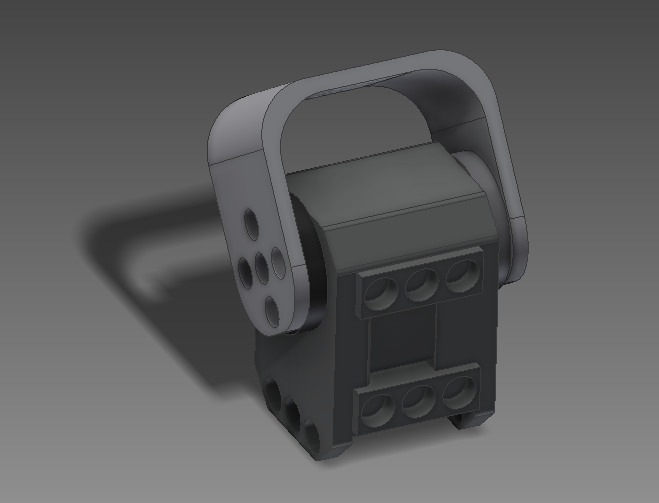
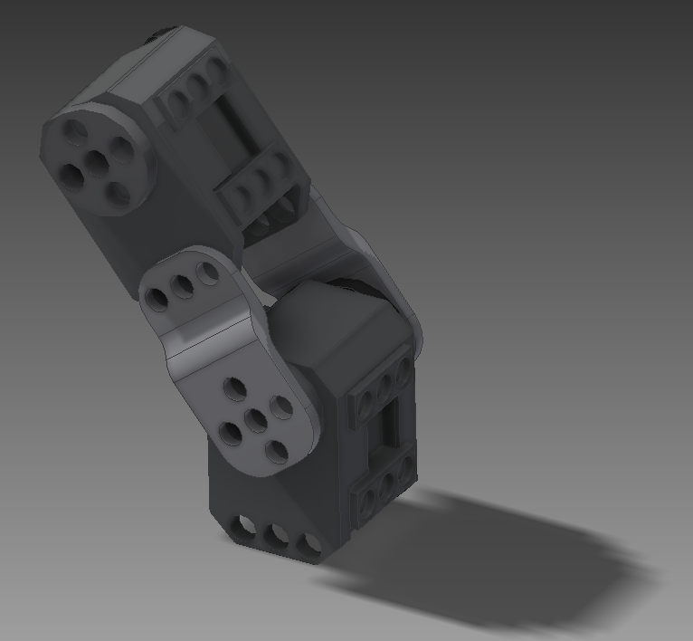
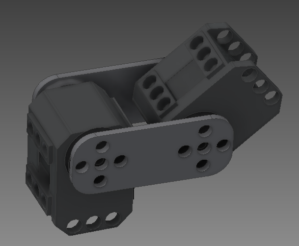
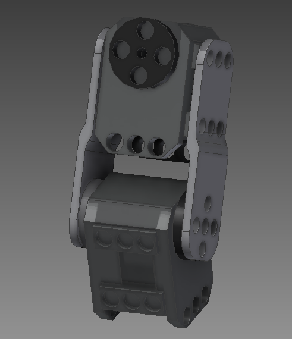

# XL320

This repository contains Dynamixel XL-320 parts, that can be printed using a 3D printer.

It contains:

* `src/` the Autodesk source files (`.iam` and `.ipt`)
* `img/` images of the parts (see below)

You can customize most of the parts using Autodesk and editing its parameters.

The parameter `Holes` contains the Ollo hole diameter (default: 4.3mm) and the parameter `Depth` contains the Ollo depth (default: 2.2mm). It may be adjusted regarding your 3D printer.

## Parts

### Pantilt

### U

### ArmToBottom

### ArmToArm

## ArmToSide

